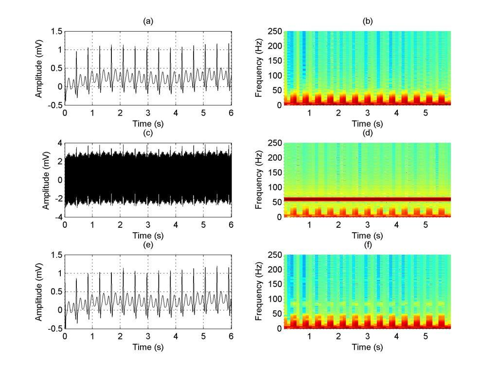

# A wavelet-based method for power-line interference removal in ECG signals
ABSTRACT

# Introduction

The analysis of electrocardiogram (ECG) signals allows the experts to diagnosis several cardiac disorders. However, the accuracy of such diagnostic depends on the signals quality. In this paper it is proposed a simple method for power-line interference (PLI) removal based on the wavelet decomposition, without the use of thresholding techniques.

# Methods

This method consists in identifying the ECG and noise frequency range for further zeroing wavelet detail coefficients in the subbands with no ECG coefficients in the frequency content. Afterward, the enhanced ECG signal is obtained by the inverse discrete wavelet transform (IDWT). In order to choose the wavelet function, several experiments were performed with synthetic signals with worse Signal-to-Noise Ratio (SNR).

# Results

Considering the relative error metrics and runtime, the best wavelet function for denoising was Symlet 8. Twenty synthetic ECG signals with different features and eight real ECG signals, obtained in the Physionet Challenge 2011, were used in the experiments. Results show the advantage of the proposed method against thresholding and notch filter techniques, considering classical metrics of assessment. The proposed method performed better for 75% of the synthetic signals and for 100% of the real signals considering most of the evaluation measures, when compared with a thresholding technique. In comparison with the notch filter, the proposed method is better for all signals.

# Conclusion

The proposed method can be used for PLI removal in ECG signals with superior performance than thresholding and notch filter techniques. Also, it can be applied for high frequencies denoising even without a priori frequencies knowledge.

# Reference
The mentioned paper can be see here: https://www.scielo.br/scielo.php?pid=S2446-47402018000100073&script=sci_arttext
DOI: https://doi.org/10.1590/2446-4740.01817

# Example of the proposed method

